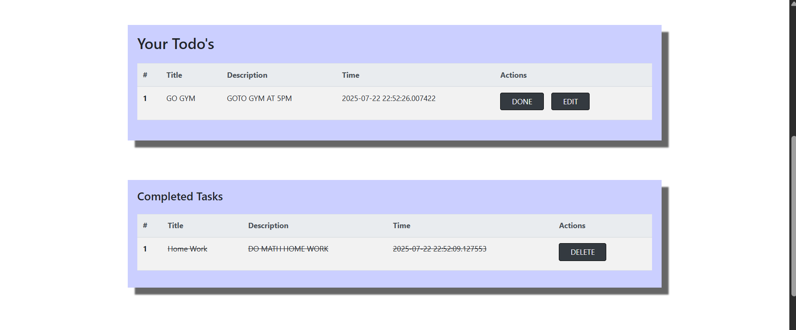

---

# 🔐 To‑Do App with User Authentication

[](https://www.python.org/)
[](https://flask.palletsprojects.com/)
[](LICENSE)

A secure, user-specific To‑Do List web application built with Flask and SQLite. This application allows users to register, log in, and manage personal task lists in a private and persistent environment.

---

### 🚫 Live Demo

📍 **Not Deployed Yet**
Deployment to Vercel/Render is in progress. A hosted version will be available soon.

---

### 📸 Screenshots

> _(Add real screenshots in `/static/screenshots/` and reference them here)_

| Register                                | Dashboard                            |
| --------------------------------------- | ------------------------------------ |
|  |  |

| Login                                                     | Deleted Tasks                           |
| --------------------------------------------------------- | --------------------------------------- |
|  |  |

| Profile Image 1                         | Profile Image 2                          |
| --------------------------------------- | ---------------------------------------- |
|  |  |

| Tasks                         |
| ----------------------------- |
|  |

---

### 📚 Project Overview

This is the advanced version of my [Go‑Todo Task](https://github.com/maazsiddiqui79/To-Do-List-Web-Application) project, enhanced with:

- Full user authentication (register/login/logout)
- Secure session handling and password hashing
- Personal task management per user
- Persistent data using SQLite

---

### 🔁 Related Project

➡️ **Looking for the basic version?**
Check out the simplified app without login:
[**Go‑Todo Task**](https://github.com/maazsiddiqui79/To-Do-List-Web-Application)

---

### 📁 Project Structure

```
To-Do-List-With-Auth/
├── static/
│   ├── style.css
│   └── screenshots/
│       ├── register.png
│       └── dashboard.png
│
├── templates/
│   ├── base.html
│   ├── login.html
│   ├── register.html
│   ├── dashboard.html
│   └── index.html
│
├── instance/
│   └── users_tasks.db
│
├── app.py
├── auth.py
├── tasks.py
├── requirements.txt
├── Dockerfile                # (Optional) for Docker deployment
├── .env                      # Environment config (optional)
└── README.md
```

---

### 🔐 Core Features

| Feature           | Description                                 |
| ----------------- | ------------------------------------------- |
| **User Accounts** | Register, login, and logout functionality   |
| **Security**      | Passwords hashed using Werkzeug             |
| **Session Mgmt.** | Persistent sessions per user                |
| **Private Tasks** | Each user sees only their own to-do list    |
| **Database**      | SQLite-backed persistent storage            |
| **Clean UI**      | Styled with HTML5/CSS3 and Jinja templating |

---

### 🧰 Tech Stack

| Tool         | Purpose                        |
| ------------ | ------------------------------ |
| Python 3.10+ | Core language                  |
| Flask        | Web framework                  |
| SQLite       | Lightweight database           |
| Werkzeug     | Secure password hashing        |
| Jinja2       | HTML templating                |
| HTML/CSS     | Frontend structure and styling |

---

### 🛠️ Local Setup

To run the project locally:

1. **Clone the repo**

   ```bash
   git clone https://github.com/maazsiddiqui79/To-Do-List-With-Auth.git
   cd To-Do-List-With-Auth
   ```

2. **Set up virtual environment**

   ```bash
   python -m venv venv
   source venv/bin/activate  # or venv\Scripts\activate (Windows)
   ```

3. **Install dependencies**

   ```bash
   pip install -r requirements.txt
   ```

4. **Run the application**

   ```bash
   flask run
   ```

5. Open in browser at: `http://127.0.0.1:5000`

---

### 📈 Planned Enhancements

- [ ] Host on Render or Vercel
- [ ] Add password reset feature
- [ ] Implement task categories and tags
- [ ] Dark mode toggle
- [ ] Dashboard UI improvements
- [ ] Admin panel (future scope)

---

### 🧑‍💻 Author

**Maaz Siddiqui**
🎓 Diploma in Computer Engineering
💻 Passionate about backend systems and clean UI design
🔗 GitHub: [github.com/maazsiddiqui79](https://github.com/maazsiddiqui79)

---

Would you like me to generate any of those now?
